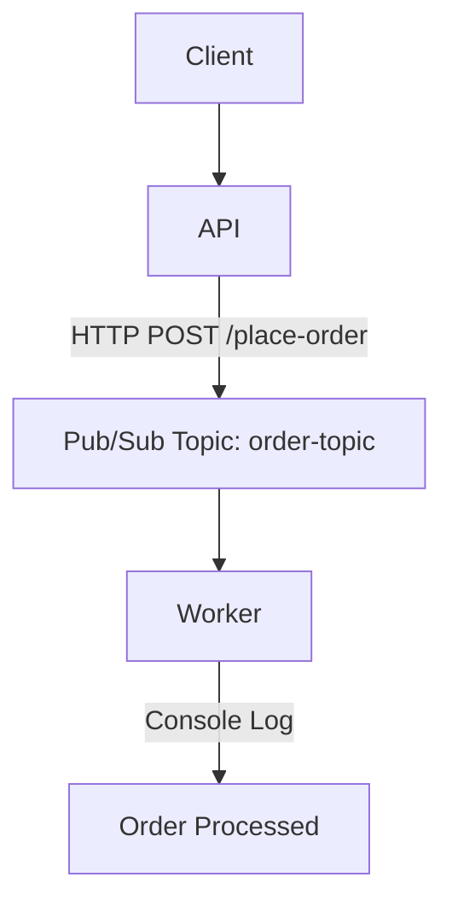

# 🛍️ Order Processing Microservice

This is a simulated microservice-based order processing system built with Flask, Google Cloud Pub/Sub, and deployed on Google Kubernetes Engine (GKE). It demonstrates end-to-end containerized application deployment on GCP using Cloud Build, Pub/Sub messaging, and JWT-based API security simulation.

---

## 🔧 Technologies Used

- 🐍 Python (Flask)
- 🐳 Docker
- ☁️ Google Cloud Platform:
  - Cloud Build
  - Pub/Sub
  - GKE (Google Kubernetes Engine)
  - ConfigMaps & Secrets
  - Google Container Registry (GCR)
- ⚙️ Kubernetes
- 🔐 Simulated JWT Auth

---

## 🧹 Architecture Overview



- The API receives order requests via `/place-order`
- Validates simulated JWT tokens
- Publishes messages to a Pub/Sub topic
- A separate worker service pulls messages and processes them

---

## ✨ Features

- 🧪 Simulated JWT auth for secure endpoint
- ⚡ Asynchronous communication using Google Pub/Sub
- 🐳 Fully containerized services
- 📦 Cloud Build + GCR for CI/CD
- ☘️ Deployed on GKE with ConfigMaps and LoadBalancer Service

---

## 🛠️ Local Development

### Prerequisites

- Python 3.10+
- Google Cloud SDK
- Docker (for local builds)

### Run API Locally

```bash
cd api
pip install -r requirements.txt
python app.py
```

### Run Worker Locally

```bash
cd worker
pip install -r requirements.txt
python worker.py
```

> Set these env vars before running locally:

```bash
export GCP_PROJECT_ID=your-project-id
export PUBSUB_TOPIC_ID=order-topic
export PUBSUB_SUB_ID=order-sub
```

---

## ☁️ Deploying to GCP (High-Level)

1. **Build & Push Images**

```bash
gcloud builds submit --tag gcr.io/YOUR_PROJECT/order-api ./api
gcloud builds submit --tag gcr.io/YOUR_PROJECT/order-worker ./worker
```

2. **Apply Kubernetes Resources**

```bash
kubectl apply -f k8s/configmap.yaml
kubectl apply -f k8s/api-deployment.yaml
kubectl apply -f k8s/api-service.yaml
kubectl apply -f k8s/worker-deployment.yaml
```

3. **Get API Endpoint**

```bash
kubectl get service order-api-service
```

4. **Test API**

```bash
curl -X POST http://<EXTERNAL-IP>/place-order \
  -H "Authorization: Bearer dummy-token" \
  -H "Content-Type: application/json" \
  -d '{"item": "Book", "quantity": 1}'
```

---

## 🧠 What This Project Demonstrates

- GCP infrastructure knowledge (GKE, Cloud Build, Pub/Sub)
- Kubernetes deployment patterns
- Secure API development (JWT simulation)
- Pub/Sub message-driven microservice design
- DevOps automation with container images and CI/CD

---

## 📂 Project Structure

```
order-processor-gke/
├── api/                  # Flask API
│   └── app.py
│   ├── Dockerfile
│   └── requirements.txt
├── worker/               # Pub/Sub consumer
│   ├── worker.py
│   ├── Dockerfile
│   └── requirements.txt
├── k8s/                  # Kubernetes YAMLs
│   ├── api-deployment.yaml
│   ├── api-service.yaml
│   ├── configmap.yaml
│   └── worker-deployment.yaml
└── README.md
```

---

## 📌 Status

✅ Project is functional and deployed\
🛠️ Adding advanced JWT validation and monitoring soon

---

## 🙋‍♂️ Author

**Kevin Asikpat** – [LinkedIn](www.linkedin.com/in/kevin-asikpata)\
Cloud & Infrastructure Engineer | GCP Certified

---

## ⭐️ Show Your Support

If you found this helpful, feel free to star ⭐ the repo or connect with me on LinkedIn!

